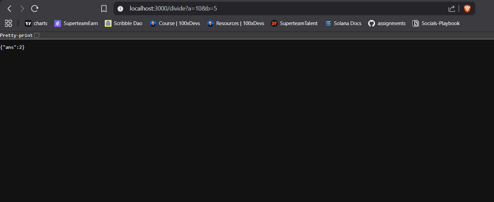
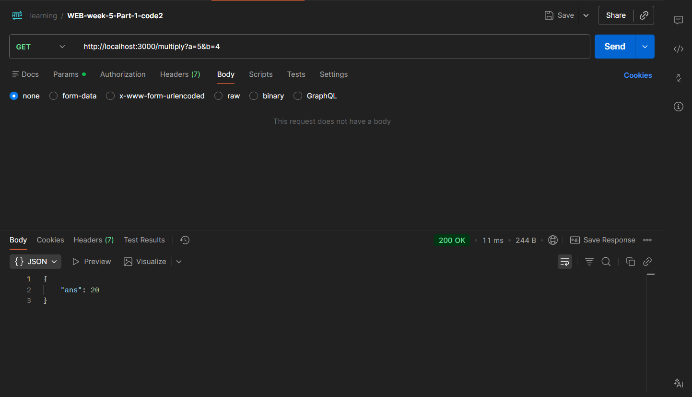

# List of things learned.

## **Headers.**

HTTP headers are key-value pairs sent between a `client` (like a web browser) and a `server` in an HTTP request or response.

They convey metadata about the request or response, such as content type, auth information, etc.

- **Example of a Request headers.**

  The headers the `client` sends out in the request are known as request headers.

  

- **Example of Response headers.**

  The headers that the `server` responds with are known as the response header.

  

### **Common headers.**

1. **Authorization** : Sends the user auth information.
2. **Content-Type** : Type of information client is sending (json, binary, etc).
3. **Referer** : Which URL is this request coming from.

## **Fetch API.**

There are 2 `high level` ways a browser can send requests to an HTTP server.

1. From the browser URL (Default GET request).
   - When you type a URL into the browser's address bar and press ENTER, the browser sends an HTTP GET request to the server.

   - This request is used to retrieve resources like HTML pages, images or other contents.

2. From an HTML form or JavaScript (various request types).
   - **HTML Forms** : When a user submits a form on a webpage, the browser sends an HTTP request based on the form’s `method` attribute, which can be `GET` or `POST`.

     Forms with `method="POST"` typically send data to the server for processing (e.g., form submissions).

   - **JavaScript (Fetch API)** : JavaScript running in the browser can make HTTP requests to a server using APIs the `fetch` API. These requests can be of various types (`GET`, `POST`, `PUT`, `DELETE`, etc.) and are commonly used for asynchronous data retrieval and manipulation (e.g., AJAX requests).

### **Fetch request examples.**

Server to send the request to - [`GET` request](https://jsonplaceholder.typicode.com/posts/1)

    <!DOCTYPE html>
    <html>

    <body>
      

      
    </body>

    </html>

  [Code](./Practise/code1/index.html)

- **Using axios (external library).**

      <!DOCTYPE html>
      <html>

      <head>
        
      </head>

      <body>
        

        
      </body>

      </html>

  [Code](./Practise/code1/index2.html)

## **Create an HTTP Server.**

It should have 4 routes,

1. http://localhost:3000/multiply?a=1&b=2
2. http://localhost:3000/add?a=1&b=2
3. http://localhost:3000/divide?a=1&b=2
4. http://localhost:3000/subtract?a=1&b=2

Inputs given at the end after `?` are known as query parameters (usually used in `GET` requests).

The way to get them in an HTTP route is by extracting them from the `req` argument (req.query.a, req.query.b)

### **Steps to follow.**

1.  Initialize a node project. `npm init -y`
2.  Install dependencies. `npm install express`
3.  Create an empty index.js. `touch index.js`
4.  Write the code to create 4 endpoints.

        const express = require("express");

        const app = express();

        app.get("/add", function(req, res) {

        });

        app.get("/multiply", function(req, res) {

        });

        app.get("/divide", function(req, res) {

        });

        app.get("/subtract", function(req, res) {

        });

        app.listen(3000);

5.  Fill in the handler body.

        const express = require("express");

        const app = express();

        app.get("/add", function(req, res) {
            const a = parseInt(req.query.a);
            const b = parseInt(req.query.b);

            res.json({
                ans: a + b
            })
        });

        app.get("/multiply", function(req, res) {
            const a = req.query.a;
            const b = req.query.b;
            res.json({
                ans: a * b
            })
        });

        app.get("/divide", function(req, res) {
            const a = req.query.a;
            const b = req.query.b;
            res.json({
                ans: a / b
            })

        });

        app.get("/subtract", function(req, res) {
            const a = parseInt(req.query.a);
            const b = parseInt(req.query.b);
            res.json({
                ans: a - b
            })
        });

        app.listen(3000);

6.  Test in the browser.

    

7.  Also try using POSTMAN.

    

## **Middlewares.**

In Express.js, **middleware** refers to functions that have access to the request object (`req`), response object (`res`) and the `next` function in the application's request-response cycle.

Middleware functions can perform a variety of tasks, such as

1. Modifying the request or response objects.
2. Ending the request-response cycle.
3. Calling the next middleware function in the stack.

Try running this code and see if the logs comes or not.

    app.use(function(req, res, next) {
        console.log("request received");
        next();
    })

    app.get("/sum", function(req, res) {
        const a = parseInt(req.query.a);
        const b = parseInt(req.query.b);

        res.json({
            ans: a + b
        })
    });

### **Modifying the request.**

    app.use(function(req, res, next) {
        req.name = "mrinmoy"
        next();
    })

    app.get("/sum", function(req, res) {
        console.log(req.name);
        const a = parseInt(req.query.a);
        const b = parseInt(req.query.b);

        res.json({
            ans: a + b
        })
    });

### **Ending the request/response cycle.**

    app.use(function(req, res, next) {
        res.json({
            message: "You are not allowed"
        })
    })

    app.get("/sum", function(req, res) {
        console.log(req.name);
        const a = parseInt(req.query.a);
        const b = parseInt(req.query.b);

        res.json({
            ans: a + b
        })
    });

### **Calling the next middleware function in the stack.**

    app.use(function(req, res, next) {
        console.log("request received");
        next();
    })

    app.get("/sum", function(req, res) {
        const a = parseInt(req.query.a);
        const b = parseInt(req.query.b);

        res.json({
            ans: a + b
        })
    });

## **Route-specific middlewares.**

Route-specific middleware in Express.js refers to middleware functions that are applied only to specific routes or route groups, rather than being used globally across the entire application.

    const express = require('express');
    const app = express();

    // Middleware function
    function logRequest(req, res, next) {
      console.log(`Request made to: ${req.url}`);
      next();
    }

    // Apply middleware to a specific route
    app.get('/special', logRequest, (req, res) => {
      res.send('This route uses route-specific middleware!');
    });

    app.get("/sum", function(req, res) {
        console.log(req.name);
        const a = parseInt(req.query.a);
        const b = parseInt(req.query.b);

        res.json({
            ans: a + b
        })
    });

    app.listen(3000, () => {
      console.log('Server running on port 3000');
    });

Only the `/special` endpoint runs the middleware.

## **Commonly uses middlewares.**

Through our `journey of writing express servers`, we did find some commonly available (on npm) middlewares that we might want to use,

1.  **express.json** : The `express.json()` middleware is a built-in middleware function in Express.js used to parse incoming request bodies that are formatted as JSON.

    This middleware is essential for handling JSON payloads sent by clients in POST or PUT requests.

         const express = require('express');
         const app = express();

         // Use express.json() middleware to parse JSON bodies
         app.use(express.json());

         // Define a POST route to handle JSON data
         app.post('/data', (req, res) => {
           // Access the parsed JSON data from req.body
           const data = req.body;
           console.log('Received data:', data);

           // Send a response
           res.send('Data received');
         });

         app.listen(3000, () => {
           console.log('Server running on port 3000');
         });

    Try converting the `calculator` assignment to user `POST` endpoints. Check if it works with/without the `express.json` middleware.

    Express uses [`bodyParser`](https://github.com/expressjs/express/blob/master/lib/express.js#L78C16-L78C26) under the hood.

## **Cors - Cross Origin Resource Sharing.**

Cross-Origin Resource Sharing (CORS) is a security feature implemented by web browsers that controls how resources on a web server can be requested from another domain.

It's a crucial mechanism for managing `cross-origin` requests and ensuring secure interactions between `different origins` on the web.

### **Cross origin request from the browser.**

### **Same request from POSTMAN.**

### **Real-world example.**

- Create an HTTP server,

      const express = require("express");

      const app = express();

      app.get("/sum", function(req, res) {
      console.log(req.name);
      const a = parseInt(req.query.a);
      const b = parseInt(req.query.b);

            res.json({
                ans: a + b
            })

      });

      app.listen(3000);

- Create an `index.html` file.

      <!DOCTYPE html>
      <html>

      <head>
        
      </head>

      <body>
        

        
      </body>

      </html>

- Serve the HTML file on a `different port`.

  `cd public`

  `npx serve`

  

You will notice the `cross origin request` fails.

- Add cors as dependency.

  `npm i cors`

- Use the `cors` middleware.

      const express = require("express");
      const cors = require("cors");
      const app = express();
      app.use(cors());

      app.get("/sum", function(req, res) {
          console.log(req.name);
          const a = parseInt(req.query.a);
          const b = parseInt(req.query.b);

          res.json({
              ans: a + b
          })
      });

      app.listen(3000);

  

### **You don't need `cors` if the frontend & backend are on the same domain.**

- Try serving the frontend on the same domain.

      const express = require("express");
      const app = express();

      app.get("/sum", function(req, res) {
          console.log(req.name);
          const a = parseInt(req.query.a);
          const b = parseInt(req.query.b);

          res.json({
              ans: a + b
          })
      });

      app.get("/", function(req, res) {
          res.sendFile(__dirname + "/public/index.html");
      });

      app.listen(3000);

- Go to `localhost:3000`, notice that the undelying request doesn't fail with `cors`. (even though we don't have the cors middleware)

  

## **Assignment.**

Try these out yourself.

1. Create a middleware function that logs each incoming request's HTTP method, URL & timestamp to the console.

    [Solution](./Assignment/code1/)

2. Create a middleware that counts total number of requests sent to a server. Also create an endpoint that exposes it.

    [Solution](./Assignment/code2)

