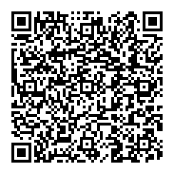

# How to Build.

```
1. Run the environment verification commands above.

2. Scaffold the project.

   Run:
     mkdir solana-pay-demo && cd solana-pay-demo
     npm init -y
     npm install @solana/pay @solana/web3.js bignumber.js qrcode
     npm install -D typescript tsx @types/node @types/qrcode

3. Create tsconfig.json (same shape as every prior week's client) and
   index.ts from the Solution section below.

4. Run it.

   Run:
     npx tsx index.ts

   You should see the generated payment URL printed, a
   payment-qr.png file appear in the folder, a payment transaction
   signature, and finally a confirmation that the detected payment's
   amount and recipient both matched what was requested.
```

---

# Output.

## QR.



## Terminal.

```Bash
mrinnnmoy@MSI:~/projects/learningCS/WEB3/Week-23/Assignment/code1$ npx tsx index.ts
Solana Pay URL:
solana:HGjTtQGMdubFRYXVYQi8qbSegdKc3zYABa9qoQmdoQVW?amount=0.001&reference=2tWqwaAUvKJWouxQ5QCs1LN6Fg5mW9dJ3NVMiy4PWU65&label=Week+23+Solana+Pay+Demo&message=Order+%234471
QR code saved to payment-qr.png

Payment sent.
Signature: 4fM1aSwNs2rmBAzNMDz8QNv2iadgGSfmntTUsvXabPkQCtmKjyMfXVRxT7CrThmmwAdbfqAEqEyp6jQe8kXCEtr4

Searching by reference public key...
Found transaction: 4fM1aSwNs2rmBAzNMDz8QNv2iadgGSfmntTUsvXabPkQCtmKjyMfXVRxT7CrThmmwAdbfqAEqEyp6jQe8kXCEtr4

Validated payment amount: confirmed
Confirmed: amount and recipient both match the original request.
```
